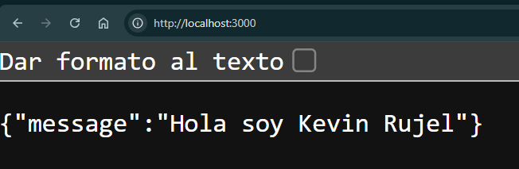
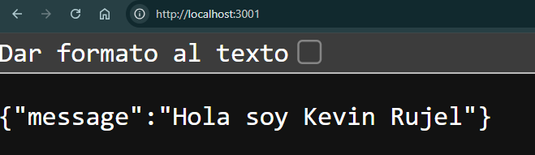
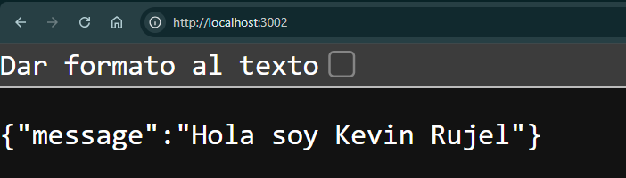

# Laboratorio 02

Hoy utilizaremos Docker Compose para poder desplegar servicios web y una base de datos PostgreSQL.

# STACK TÉCNICO

## API

Para el servicio web se utilizó la aplicación:

nmatsui/hello-world-api

Se descargó el repositorio fuente:

git clone https://github.com/nmatsui/hello-world-api.git api

La aplicación fue dockerizada mediante un Dockerfile y desplegada utilizando Docker Compose.

Se crearon 3 copias de la API:

- api01 → puerto 3000
- api02 → puerto 3001
- api03 → puerto 3002

Cada API se ejecuta en un contenedor independiente.

## Ejemplo de ejecución manual:

docker pull nmatsui/hello-world-api

docker run -d --rm -p 3000:3000 nmatsui/hello-world-api

## Para desplegar los servicios mediante Docker Compose:

docker compose up -d

## BD PostgreSQL

Se utilizó PostgreSQL como base de datos.

## Imagen utilizada:

postgres:13

## Configuración utilizada:

docker run --name some-postgres -e POSTGRES_PASSWORD=mysecretpassword -d postgres

## Configuración mediante Docker Compose:

db:
  image: postgres:13

# Variables utilizadas:

POSTGRES_DB_NAME=mi_db
POSTGRES_DB_USER=mi_user
POSTGRES_DB_PASSWORD=mi_clave

## Puerto utilizado:

5432:5432

---

# VOLUMEN

Para mantener la información de PostgreSQL se utilizó un volumen Docker.

Configuración:

## volumes:
  - postgresData:/var/lib/postgresql/data

## Declaración del volumen:

volumes:
  postgresData:
    driver: local

# Comando para verificar:

docker volume ls

# COMANDOS

## Levantar los servicios:

docker compose up -d

## Construir imágenes y levantar servicios:

docker compose up -d --build

## Ver contenedores activos:

docker ps

## Ver estado de servicios:

docker compose ps

## Detener servicios:

docker compose down

## Ver volúmenes:

docker volume ls

# CONFIGURACIONES

## Archivo .env

## Se utilizaron variables de entorno para configurar los servicios.

MI_NOMBRE=Kevin Rujel

APELLIDO=Rujel

CURSO=Infraestructura

POSTGRES_DB_NAME=mi_db

POSTGRES_DB_USER=mi_user

POSTGRES_DB_PASSWORD=mi_clave

# EVIDENCIAS

## API 01

## API 02

## API 03

# Tipos de redes en docker

**Bridge:** Red por defecto de Docker. Permite la comunicación entre contenedores del mismo equipo.

**Host:** El contenedor utiliza directamente la red del equipo anfitrión.

**None:** Aísla el contenedor, sin conexión de red.

**Overlay:** Permite comunicación entre contenedores ubicados en diferentes máquinas.

# Tipos de volumenes en docker

**Named Volume:** Volumen administrado por Docker para almacenar datos persistentes, usado principalmente en bases de datos.

**Bind Mount:** Conecta una carpeta del equipo anfitrión con una carpeta del contenedor.

**Tmpfs:** Volumen temporal que almacena datos en memoria RAM y se elimina al detener el contenedor.